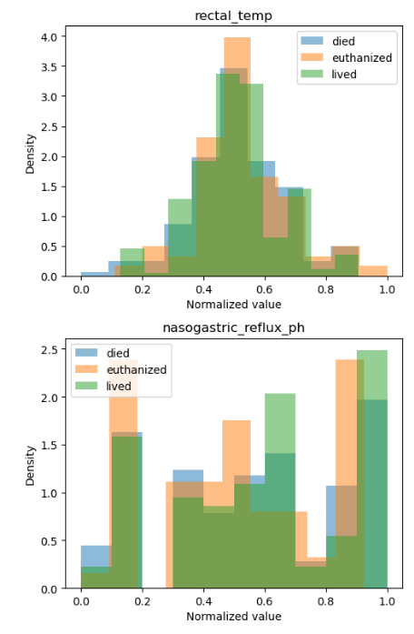
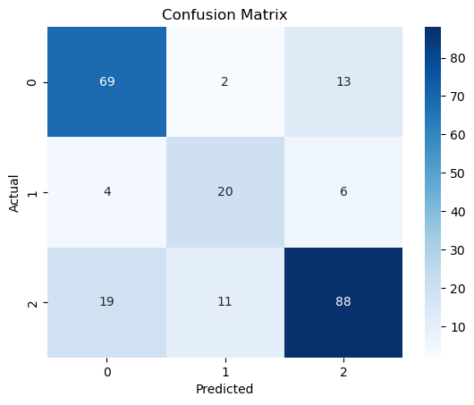
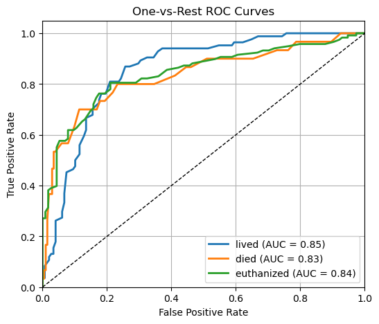
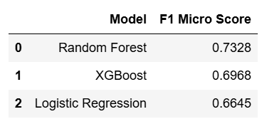

# Predict Health Outcomes of Horses

* This repository holds an attempt to predict the health outcomes of horses using clinical and physiological data from the “Playground Series S3E22” Kaggle challenge.


## Overview

The task is to use tabular data of clinical and physiological measurements collected on horses to predict one of three outcomes:  lived, died or euthanized; using micro F1 score. 
On the test set, the final model used- Random Forest with GridCV achieved a 76% micro‑F1 score—demonstrating a well‑balanced precision and recall, with comparison to the Kaggle leaderboard top of 78%.This project formulates the problem as classification task.

_______________________________________________________________________________________________________________________________________________________________________________
## Approach
 * Compared the performance of three different models—Logistic Regression, Random Forest (with hyperparameter tuning), and XGBoost—using a micro‑averaged F1 score as the primary metric
 * Micro F1: weights every example equally, a good number to report when you care about your model’s overall accuracy on **imbalanced classes**
   
### Data
**Type:** 
    * Input: CSV files (`train.csv`, `test.csv`) containing 28 clinical features per horse.
    * Output: Categorical “outcome” label with three classes: `lived`, `died`, `euthanized`.
**Size:**
  * Training Set : ~1,235 rows × 29 columns (28 features + target). 
  * Test Set : ~824 rows × 28 columns (features only).
    
 **Type Counts:**
-Numerical: 11 features
-Categorical: 13 features
-Binary: 4 features

### Features :
 * Numeric: vitals (temperature, pulse, respiratory rate), blood values (packed cell volume, total protein, abdominal fluid protein), and lesion codes.
 * Binary : surgery, age, surgical lesion, CP data.
 * Categorical exams: mucous membrane color, cap refill time, pain score, abdominal distention, nasogastric reflux, rectal feces appearance, etc.

#### Preprocessing / Clean up

* Collapsed three lesion columns into a single binary `lesion_present` feature.
* Scaled using `RobustSCcaler`.
* Log‑transformed skewed numerical variables via `np.log1p`.  
* One‑hot encoded all categorical and binary columns using `pd.get_dummies()`.  
* Ensured dummy columns were cast to integer type..


#### Data Visualization

* Explored outliers and distributions via boxplots and histograms of numerical features.  


We can already visibly see outliers, and also notice how lesion 1 and 2 are not very important features to outcome and are so close to 0, which was handled while cleaning data
  
### Problem Formulation

**Input / Output**  
  * **Input**: Preprocessed feature matrix of shape `(n_samples, n_features)`.  
  * **Output**: Predicted class label from {`lived`, `died`, `euthanized`}.

**Models Tried**  
  1. **Logistic Regression** (baseline)  
  2. **Random Forest Classifier**

* Hyperparameters tuned via `GridSearchCV` over
* `n_estimators`: [100, 200, 300]  
* `max_depth`: [10, None]  
* `min_samples_split`: [5, 10]  
* `class_weight`: ['balanced']  
     * Scoring: micro‑averaged F1, 5‑fold cross‑validation  
  3. **XGBoost Classifier** (`objective='multi:softprob'`, 100 trees)

  

* Micro F1: ~76% of all predictions are correct.
-Died (0): 69/84 correct.
-Euthanized (1): 20/30 correct.
-Lived (2): 88/118 correct.


**Loss & Optimizer**  
* All models use their library defaults (log‑loss for LR & XGB,RF).  
* Hyperparameter tuning guided by micro‑F1 scorer.
  

### Training

* **Environment**  
  * Python 3.8+  
  * Libraries: `pandas`, `numpy`, `scikit-learn`, `xgboost`, `matplotlib`  
  * Hardware: Local machine / Colab GPU (not strictly required)
   
 **Procedure**  
  1. Load `train.csv` into `pandas`.  
  2. Apply `preprocess()` to encode and transform features.  
  3. Split into train/test sets (70/30 for RF, 80/20 for XGB).  
  4. Fit each model; for RF, perform grid search with verbose output.  
  5. Evaluate on held‑out test data.

 **Training Time**  
  * Logistic Regression: ~ seconds
  * Random Forest + GridSearchCV: ~ minutes
  * XGBoost: ~ seconds


* All three curves sit well above the diagonal, showing the model separates each outcome reliably. 
* The AUCs (lived = 0.85, euthanized = 0.84, died = 0.83) mean it ranks true cases higher than false about 83–85% of the time.

**Stopping Criteria**  
* RF GridSearchCV runs full 5‑fold on all parameter combinations.  
* Early stopping not used; models train to completion.

**Challenges**  
  * Moderate class imbalance—addressed via `class_weight='balanced'` and micro‑F1 scoring.  
  * Skewed distributions—handled via log transforms.


### Performance Comparison

* The best model was RandomForest, it was even improved after cross validation score on the test set with a Test micro-F1: 0.7629

  


  
### Conclusions

* The tuned Random Forest delivered the highest micro‑averaged F1 score and balanced performance across all classes.  
* Logistic regression was fast but underperformed on minority classes.  
* XGBoost offered a trade‑off between performance and training time.

### Future Work

* Explore neural network architectures (e.g., TabNet, deep MLP) for potential gains.  
* Incorporate feature selection or dimensionality reduction (PCA, LASSO).  
* Test ensemble stacking of RF + XGBoost + LR.  
* Perform more extensive hyperparameter tuning (Bayesian optimization).


#### Performance Evaluation

1. **Clone the repo**  
   ```bash
   git clone https://github.com/sxy8945/DATA3402-KaggleProject


## Citations
Kaggle 
Walter Reade and Ashley Chow. Predict Health Outcomes of Horses.
https://kaggle.com/competitions/playground-series-s3e22, 2023. Kaggle.


